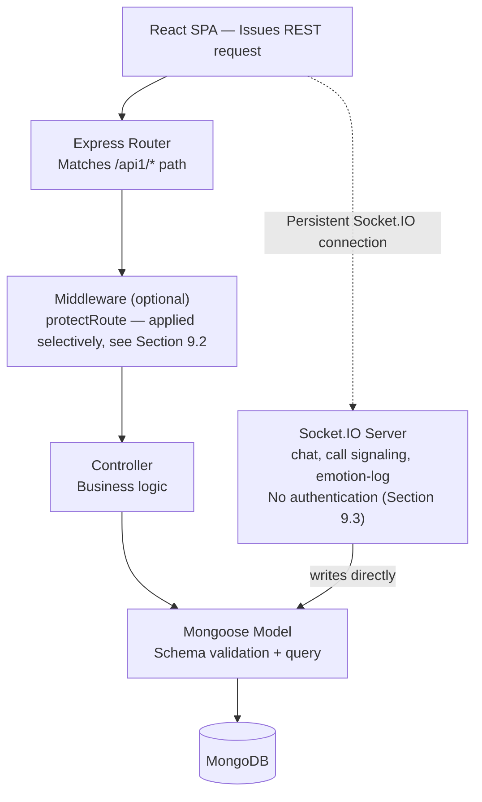
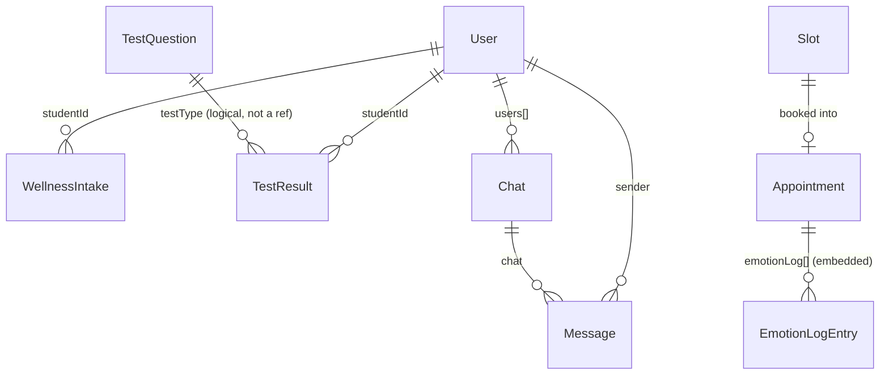

# MindEase — Software Architecture Document

**Version 1.0 — July 2026**
**Smart India Hackathon 2025 | Team Codix | Problem ID: 25092**
Source: direct analysis of the MindEase codebase (this repository).

---

## Table of Contents

1. [Introduction](#1-introduction)
2. [System Overview](#2-system-overview)
3. [Technology Architecture](#3-technology-architecture)
4. [High-Level Architecture](#4-high-level-architecture)
5. [Frontend Architecture](#5-frontend-architecture)
6. [Backend Architecture](#6-backend-architecture)
7. [Database Architecture](#7-database-architecture)
8. [API Architecture](#8-api-architecture)
9. [Authentication & Security](#9-authentication--security)
10. [Request & Data Flow](#10-request--data-flow)
11. [External Integrations](#11-external-integrations)
12. [Architectural Strengths](#12-architectural-strengths)
13. [Architectural Limitations](#13-architectural-limitations)

---

## 1. Introduction

### 1.1 Purpose of This Document

This Software Architecture Document (SAD) describes how the MindEase platform is designed and how its
components interact. It is written directly from the codebase in this repository — not from a spec or a design
doc written in advance — and is intended to communicate the system's actual structure, not its aspirational
one. Where the code does something different from what the README or comments imply, this document
describes what the code does.

Where an architectural detail (a formal deployment topology, a named design pattern, a CI/CD pipeline) is
simply absent from the repository, this document says so explicitly rather than inferring or inventing one.

### 1.2 Scope

In scope: system and component organization; frontend and backend architecture; database architecture and
data organization; API architecture; authentication and security; request/data flow; and external service
integrations; strengths and limitations as evidenced by the code.

Out of scope: an endpoint-by-endpoint API reference and a full UI page inventory (covered in
`docs/TECHNICAL_DOCUMENTATION.md`), and anything not present in the repository — including a formal
deployment topology, infrastructure-as-code, a CI/CD pipeline, and observability tooling.

### 1.3 Intended Audience

- Developers onboarding onto the MindEase codebase.
- Technical reviewers and judges evaluating the system's design and maturity.
- Maintainers planning remediation of the gaps listed in Section 13.

---

## 2. System Overview

### 2.1 Application Summary

MindEase is a digital mental health and psychological support platform for students in higher education. It
connects two account roles — **student** and **counsellor** — around confidential screening, AI-assisted risk
assessment, live counselling (chat and video), peer support, and a curated self-help/AI-chat resource layer.

The system is composed of a React single-page frontend, a central Node/Express API that also hosts a
Socket.IO server, a MongoDB document store accessed through Mongoose, four independent Python/FastAPI
microservices, one independent Node/Express microservice, and a set of external integrations (Google
Gemini, Google OAuth, Spotify, Cloudinary, Gmail SMTP).

### 2.2 Architectural Style

Unlike a typical single-backend "modular monolith," MindEase is implemented as a genuine set of small,
independently-runnable services, each owning one capability:

| Concern | Service | Language/Framework |
|---|---|---|
| Core app (auth, appointments, slots, tests, wellness, chat, real-time) | `backend/` | Node.js / Express + Socket.IO |
| ML risk assessment (classification, clustering, association mining) | `ml-service/` | Python / FastAPI |
| Student ID verification (OCR) | `StudentVerification/` | Python / FastAPI |
| Spotify OAuth + playback proxy | `Spotify/` | Node.js / Express |
| AI Support RAG chatbot | `chat-service/` | Python / FastAPI |
| Frontend | `frontend/` | React (Vite) |

This is closer to a genuine microservice decomposition than a monolith-plus-satellite pattern: each Python
service is independently deployable, has its own dependency tree (`.venv`), and communicates with the
frontend either directly (ML, OCR, chat, Spotify) or is orchestrated by the backend for cross-cutting features
(the Node backend proxies to `ml-service` for risk scores shown in the counsellor Analysis dashboard, but the
frontend also calls several of these services directly — see Section 4).

There is no API gateway, reverse proxy, or service mesh in front of any of these processes. Each service is
reached at its own port, directly, from the browser or from the backend as appropriate.

### 2.3 Major System Components

| Component | Description |
|---|---|
| React SPA | Single-page frontend (Vite build), organized by role (`student/`, `counsellor/`), communicating with the backend over REST and Socket.IO, and with three of the Python services directly. |
| Express API | The main backend process (`server.js`); hosts REST routes under `/api1/*`, the Socket.IO server (chat, WebRTC signaling, live emotion-log relay), and Passport-based Google OAuth. |
| MongoDB | Document database accessed via Mongoose; the sole persistence layer, hosted on MongoDB Atlas. |
| ml-service | FastAPI microservice serving a Random Forest/Logistic Regression risk classifier, a Decision Tree wellness-score regressor, K-Means risk clustering, and Apriori association mining — trained on a public Kaggle student-depression dataset. |
| StudentVerification | FastAPI microservice performing OCR (EasyOCR) + fuzzy string matching against an uploaded ID card photo, gating student account verification. |
| chat-service | FastAPI microservice implementing a Retrieval-Augmented Generation chatbot over a curated markdown resource library, using Gemini for both embeddings and generation, with a deterministic crisis-keyword safety gate. |
| Spotify | Standalone Express microservice proxying Spotify's OAuth/playback API for the Music Therapy feature. |
| Client-side emotion detection | Not a service — `face-api.js` (TensorFlow.js) running in the browser during video calls; see Section 4.3. |

### 2.4 General Application Flow

The React SPA issues REST calls to the Express API for most reads/writes (auth, appointments, slots, tests,
wellness intake) and maintains a persistent Socket.IO connection for chat, WebRTC call signaling, and live
emotion-log relay during calls. Separately, and bypassing the Express API entirely, the browser talks directly
to three of the Python microservices (`ml-service` for risk data shown on the student dashboard,
`StudentVerification` for the OCR upload step, `chat-service` for the AI Support chatbot) and to the standalone
Spotify service. The Express API is the only component that talks to MongoDB.

---

## 3. Technology Architecture

| Technology | Purpose | Role & Interaction |
|---|---|---|
| React 18 (Vite) | Frontend UI library | Renders the SPA; communicates with the backend via REST/Socket.IO and with three Python services directly via `fetch`/`axios`. |
| React Router | Client-side routing | Role-scoped routes (`/student/:id/...`, `/counsellor/:id/...`) defined in `App.jsx`. |
| Tailwind CSS | Utility-first CSS | Styling across the component set. |
| `react-i18next` | Internationalization | English/Hindi/Marathi/Tamil locale files; coverage is partial (see Section 13). |
| `simple-peer` + `vite-plugin-node-polyfills` | WebRTC | Peer-to-peer video calling; the polyfill plugin supplies the Node `global`/`process`/`Buffer` shims `simple-peer`'s dependency tree expects in a browser context. |
| `face-api.js` (`@vladmandic/face-api`) | Client-side ML | 7-class facial emotion detection during video calls, running entirely in-browser via TensorFlow.js; model weights served as static assets from `frontend/public/models/`. |
| Socket.IO (client) | Real-time client | Persistent connection to the backend's Socket.IO server for chat, WebRTC signaling, and emotion-log relay. |
| Node.js / Express | Backend runtime + framework | Runs the main API (`backend/server.js`) and the standalone Spotify proxy. |
| Mongoose | MongoDB ODM | Defines the eight data schemas and mediates all reads/writes from the Express API. |
| Socket.IO (server) | Real-time server | Attached to the same HTTP server as Express; no authentication at the socket layer (see Section 9.3). |
| Passport.js (`passport-google-oauth20`) | OAuth strategy | Google sign-in; always provisions the `student` role regardless of which role the user intended (see Section 13). |
| `express-session` + `connect-mongo` | Session store | Backs the Passport OAuth flow; sessions persisted in MongoDB. |
| JWT (`jsonwebtoken`) | Stateless auth | Issued on local signup/login and on the OAuth callback; stored in an httpOnly cookie (not `localStorage`). |
| `bcryptjs` | Password hashing | Hashes passwords in `auth.controller.js` before persistence (only for local signups — OAuth accounts have no password). |
| `express-rate-limit` | Abuse mitigation | Rate-limits `/signup` and `/login` (20 attempts/15 min per IP); not applied elsewhere. |
| Multer + Cloudinary | File upload | Profile pictures and ID-card photos, uploaded to Cloudinary via `multer-storage-cloudinary`. |
| FastAPI | Python web framework | Powers `ml-service`, `StudentVerification`, and `chat-service`. |
| scikit-learn / pandas / mlxtend | ML | Random Forest, Logistic Regression, Decision Tree Regression (`ml-service`), Apriori (`mlxtend`) association mining. |
| OpenCV + EasyOCR + RapidFuzz | OCR | Student ID card text extraction and fuzzy matching (`StudentVerification`). |
| FAISS | Vector search | In-memory similarity search over embedded resource-document chunks (`chat-service`). |
| Google Generative AI (Gemini) | LLM | Embeddings + generation for the AI Support chatbot, called via direct REST (`httpx`), not the official SDK — see Section 13 for why. |
| Nodemailer (Gmail SMTP) | Email | Appointment booking-confirmation emails; failures are caught and logged, never fail the booking itself. |

---

## 4. High-Level Architecture

### 4.1 Process Topology

Six independent processes make up the full system when fully operational:

| Process | Entry Point | Port | Role |
|---|---|---|---|
| Frontend dev server | `frontend/` (Vite) | 5173 | React SPA |
| Main API | `backend/server.js` | 5001 | REST + Socket.IO |
| ML service | `ml-service/app.py` | 5002 | Risk assessment |
| Student Verification | `StudentVerification/main.py` | 8000 | OCR |
| Spotify proxy | `Spotify/server.js` | 5005 | Music Therapy |
| AI Support chat | `chat-service/main.py` | 5007 | RAG chatbot |

There is no API gateway, reverse proxy, or load balancer in front of any of these processes; the frontend
reaches each one directly by its own configured base URL (`VITE_API_URL`, `VITE_STUDENT_VERIFICATION_URL`,
`VITE_SPOTIFY_SERVICE_URL`, `VITE_CHAT_SERVICE_URL` — see `docs/TECHNICAL_DOCUMENTATION.md` Section 15
for the full environment-variable map).

### 4.2 System Topology Diagram

```mermaid
flowchart LR
    SPA["React SPA (Vite)\nlocalhost:5173"]
    API["Express API\nserver.js — localhost:5001\nREST + Socket.IO"]
    Mongo[(MongoDB Atlas\nvia Mongoose\n8 collections)]
    ML["ml-service\nlocalhost:5002\nFastAPI"]
    OCR["StudentVerification\nlocalhost:8000\nFastAPI"]
    Spotify["Spotify proxy\nlocalhost:5005\nExpress"]
    Chat["chat-service\nlocalhost:5007\nFastAPI + FAISS"]
    Gemini["Google Gemini API"]
    SpotifyExt["Spotify Web API"]
    GAuth["Google OAuth"]
    Cloudinary["Cloudinary"]
    SMTP["Gmail SMTP"]

    SPA -- "REST /api1/*" --> API
    SPA -- "Socket.IO (chat, WebRTC signaling,\nemotion-log relay)" --> API
    API -- Mongoose --> Mongo
    API -- "OAuth redirect" --> GAuth
    API -- "upload" --> Cloudinary
    API -- "booking email" --> SMTP

    SPA -. "direct: risk/wellness data" .-> ML
    SPA -. "direct: ID card upload" .-> OCR
    SPA -. "direct: OAuth + playback" .-> Spotify
    SPA -. "direct: chat messages" .-> Chat

    Spotify -. --> SpotifyExt
    Chat -. "embeddings + generation" .-> Gemini

    API -. "proxied risk queries\n(counsellor Analysis dashboard)" .-> ML
```

*Solid arrows: backend-mediated. Dashed arrows: client-direct or service-direct calls that bypass the Express API.*

### 4.3 A Note on Emotion Detection

Earlier in this project's development, real-time facial emotion detection during video calls was implemented
as a seventh microservice (`emotion-service/`, OpenCV + a CNN via TensorFlow Lite). It has since been fully
migrated to run **client-side**, using `face-api.js` (TensorFlow.js) directly in `VideoCall.jsx` — the browser
detects the local participant's expression, relays the label to the other participant over the existing Socket.IO
call-signaling channel, and the backend persists a timestamped log on the `Appointment` record for a
post-call summary (see Section 7.2). No camera frame is ever sent to a server for this feature. The old service
directory has been removed from the repository; nothing in the current codebase references it.

### 4.4 Component Interaction — Request Path Through the Backend



---

## 5. Frontend Architecture

### 5.1 Overall Structure

The frontend is a React 18 single-page application built with Vite. Source is organized under `frontend/src`
into `pages/` (the bulk of the UI, split into `student/` and `counsellor/` role folders plus root-level public
pages), `components/` (shared UI, including the `chat/` subtree for peer support), `contexts/` (`AuthContext`),
and `lib/` (the `api.js` HTTP client and `i18n.js` setup). `App.jsx` defines the full route table; `main.jsx` is the
entry point.

### 5.2 Routing

Role-scoped routes follow the pattern `/{role}/:{role}Id/{page}` (e.g. `/student/:studentId/wellness-intake`,
`/counsellor/:counsellorId/analysis`), nested under a per-role dashboard layout (`StudentDashboard.jsx`,
`CounsellorDashboard.jsx`) that renders a persistent sidebar via `<Outlet/>`. `VideoCall.jsx`
(`/call/:appointmentId`) is a standalone top-level route with no persistent nav, by design (an immersive
full-screen call UI).

An unverified student is redirected to `/student/verify` (`StudentForm.jsx`) by frontend logic checking
`user.isVerified` — there is no server-side route guard enforcing this; a student who never completes OCR
verification is simply never sent there by the UI, not blocked by the API from otherwise using it.

### 5.3 State Management

There is no Redux/Zustand/global store. Auth state (the current user, login/logout/OAuth handlers) is held in
a single `AuthContext`; the chat subsystem has its own `ChatProvider` context scoped to the `components/chat`
tree.

### 5.4 Communication with the Backend and Services

`frontend/src/lib/api.js` exports two configured `axios` instances (`api`, `axiosInstance`) built from
`VITE_API_URL`, both used consistently by the pages that talk to the main backend — this was **not** always
the case; hardcoded `localhost` URLs across roughly a dozen files were replaced with environment-driven
config during this project's hardening pass (see Section 13 for what's still not deployment-ready despite that
fix). Each of the three directly-called Python services and the Spotify proxy has its own `VITE_*_SERVICE_URL`
environment variable with a `localhost` fallback, read independently in the pages that call them
(`WellnessIntake`/`AllTests` → ml-service indirectly via the backend; `StudentForm.jsx` → `StudentVerification`
directly; `ChatBot.jsx` → `chat-service` directly; `MusicTherapy.jsx`/`Home.jsx` → Spotify directly).

### 5.5 Internationalization

`react-i18next` with English/Hindi/Marathi/Tamil locale JSON files exists and is genuinely wired up — but
coverage is partial. `Home.jsx`, `StudentDashboard.jsx`, `DashboardHome.jsx`, `WellnessIntake.jsx`,
`MusicTherapy.jsx`, `VideoCall.jsx`, and `ChatBot.jsx` are localized; the counsellor-side pages and several
other student pages (tests, reports, resources, peer support) are not. This is a documented gap, not a
misrepresentation — see Section 13.

---

## 6. Backend Architecture

### 6.1 Overall Organization

The backend is a single Express application (`backend/server.js`) organized into `config/` (Mongoose
connection), `routes/` (one Express router per resource), `controllers/` (business logic), `models/` (Mongoose
schemas), `middelware/` (JWT/session auth, rate limiting, Multer upload — note the retained source-directory
spelling), and `utils/` (username generation, verification-status helpers, Passport strategy config).

### 6.2 Request Handling

A typical request flows through `server.js`'s mounted router, optionally through `protectRoute` if the specific
route applies it, into a controller, into a Mongoose model, then to MongoDB, returning JSON. There is no API
gateway or centralized routing layer beyond Express's own router mounting.

### 6.3 Real-Time Layer

A single Socket.IO server shares the same HTTP server as Express (`backend/server.js`). It handles: chat
messaging events (`setup`, `join chat`, `typing`/`stop typing`, `new message`); WebRTC call signaling
(`join-call`, `call-signal`, `leave-call`, `call-peer-left`, plus a `call-room-status` handshake that tells a
newly-joined initiator whether the other participant is already present — added specifically to close a race
condition where the very first WebRTC offer could be broadcast into an empty room and silently lost); and
`emotion-update`, which both relays a live emotion label to the other call participant and appends a
timestamped entry to the `Appointment.emotionLog` array (fire-and-forget; a failed write never breaks the
live relay or the call itself).

### 6.4 Middleware

`auth.middleware.js` exports `protectRoute`: it first checks for an existing Passport session (`req.user`), then
falls back to verifying a JWT from the `jwt` httpOnly cookie, loading the user (password field excluded) and
attaching it to `req.user`. There is no `authorize(role)`-style middleware — role checks, where they exist at
all, are performed inline inside individual controllers or, more commonly, only on the frontend (see Section
9.2 for exactly which routes this leaves unprotected).

`rateLimit.js` exports `authLimiter` (20 requests/15 minutes per IP), applied only to `/signup` and `/login`.

`multer.js` configures `multer-storage-cloudinary` for profile-picture and ID-card uploads, with no explicit
file-size or MIME-type restriction of its own beyond what Cloudinary's `allowed_formats` option enforces
(`jpg`, `png`, `jpeg`).

### 6.5 Validation and Error Handling

Validation is ad hoc and controller-specific; no shared schema-validation library (Joi, Zod,
`express-validator`) is present in the dependency list. Mongoose's own schema constraints (`required`, `enum`,
`min`/`max`) are the last line of defense in most controllers. Error handling likewise has no shared
middleware — each controller implements its own `try/catch`, generally returning `{ message }` with a 500
status on unhandled failure.

---

## 7. Database Architecture

### 7.1 Database Technology

MongoDB, accessed exclusively through Mongoose from the Express API, hosted on MongoDB Atlas. No other
database technology (relational, cache, or search — FAISS in `chat-service` is an in-memory index, not a
database) is used anywhere.

### 7.2 Data Organization

Eight collections: `User`, `Slot`, `Appointment`, `TestQuestion`, `TestResult`, `WellnessIntake`, `Chat`,
`Message`. `User` is the central collection, referenced by every other collection either via a true Mongoose
`ObjectId` ref (`WellnessIntake.studentId`, `TestResult.studentId`, `Chat.users[]`, `Message.sender`) or via a
plain string field populated from the user's own record at write time (`Slot.counsellorName`/
`counsellorEmail`, `Appointment.studentName`/`studentEmail`/`counsellorName`/`counsellorEmail` — these are
denormalized copies, not references, so they do not automatically reflect a later profile-name change).



### 7.3 Storage Approach

The schema is document-oriented and denormalized in the same spirit as most MERN applications: a booked
`Slot`'s counsellor identity is copied onto the resulting `Appointment` rather than joined at read time, and a
`TestResult` document embeds every attempt a student has ever made across all three screening tools as a
`tests[]` array on a single per-student document, rather than one document per attempt. `Appointment` also
embeds its own `emotionLog[]` (timestamp, emotion, confidence, participant role) directly, keeping a call's
affect timeline co-located with the appointment record it belongs to.

### 7.4 Persistence Strategy

No MongoDB transactions or multi-document ACID guarantees are used. Booking an appointment, for
example, performs a `Slot.isBooked = true; slot.save()` followed by a separate `Appointment.create(...)` as
two sequential, non-atomic writes — a crash between them would leave a slot marked booked with no
corresponding appointment. Confirmation emails are explicitly isolated from this write sequence (wrapped in
their own `try/catch`, added specifically after a bug where a Nodemailer failure was crashing the whole
booking response even though the database writes had already succeeded).

### 7.5 Indexing

No explicit secondary indexes beyond MongoDB's default `_id` index are defined in any of the Mongoose
schemas in this codebase. Query patterns (fetching a student's appointments by ID, a counsellor's slots by
email) rely on default/implicit indexing behavior.

### 7.6 Not Specified

- No formal entity-relationship diagram exists in the repository (the one in Section 7.2 is this document's own construction from the schema files).
- No database migration tooling. Two ad hoc one-off scripts exist (`backend/seeder.js` for the `TestQuestion` reference data, `backend/seedDemo.js` for realistic demo data) — neither is a migration framework.
- No documented backup, retention, or archival strategy.
- No sharding, replication, or high-availability configuration beyond whatever Atlas provides by default.

---

## 8. API Architecture

### 8.1 API Organization

A REST-style JSON API served from the Express process under the `/api1` prefix, with one router file per
resource (`slotRoutes.js`, `appointmentRoutes.js`, `studentRoutes.js`, `counsellorRoutes.js`, `userRoutes.js`,
`testRoutes.js`, `analysisRoutes.js`, `mlRoutes.js`, `wellnessRoutes.js`, `authRoutes.js`, `chatRoutes.js`,
`messageRoutes.js`). Response shape is not perfectly uniform: most controllers return either the raw
Mongoose document/array directly or a `{ message }` error object, rather than a consistent
`{ success, data }` envelope.

### 8.2 Request Flow

A client request reaches Express, is matched against a mounted router's path, optionally passes through
`protectRoute` if that specific route applies it, is handled by a controller, and results in one or more
Mongoose calls. Where no middleware is applied, the controller trusts whatever ID is supplied in the request
body or URL params (e.g. `bookAppointment` trusts a `studentId` field in the POST body with no check that it
matches the caller's own session).

### 8.3 Full Endpoint Listing

See `docs/TECHNICAL_DOCUMENTATION.md` Section "API Overview" for the complete endpoint-by-endpoint
listing; this document covers organization and patterns only.

---

## 9. Authentication & Security

### 9.1 Authentication Mechanism

Two independent login paths exist. **Local**: `POST /api1/signup`/`login` issue a JWT
(`jwt.sign({userId, role}, JWT_SECRET, {expiresIn: "7d"})`) and set it as an **httpOnly cookie** named `jwt`
(`secure: true` only in production, `sameSite: "lax"`) — this is a materially different, more defensible choice
than storing the token in `localStorage`, since it is inaccessible to JavaScript and therefore not directly
exposed to XSS. **Google OAuth**: handled by Passport (`passport-google-oauth20`), backed by an
`express-session` store persisted in MongoDB (`connect-mongo`); on success the callback route also issues the
same JWT cookie, so both paths converge on the same downstream auth mechanism. The OAuth path always
provisions `role: "student"` regardless of which role the user selected on the frontend's Login/Signup toggle
— there is no way to create a counsellor account via Google (see Section 13).

Passwords are hashed with `bcryptjs` (`bcrypt.hash(password, 10)`) in `auth.controller.js` before persistence.
OAuth accounts have no password field at all (`User.password` is conditionally required only when
`googleId` is absent, enforced by a schema-level `pre("validate")` hook).

### 9.2 Authorization Model — Actual Coverage

There is no role-based `authorize(...)` middleware anywhere in the codebase. The table below reflects the
actual, current state of every route file in `backend/routes/`, verified directly against source rather than
inferred:

| Fully Protected (`protectRoute`) | Partially Protected | Unprotected (client-supplied IDs only) |
|---|---|---|
| `/api1/me` (GET, DELETE) | `/api1/slots` — GET and POST protected; **PUT `/:id` and DELETE `/:id` are not** | `/api1/appointments/*` (all routes — booking, status updates, listing) |
| `/api1/users/update`, `/api1/users/search`, `/api1/users/debug` | | `/api1/analysis`, `/api1/ml/*` |
| `/api1/chat/*` (all routes) | | `/api1/students/:id`, `/api1/counsellors/:id` |
| `/api1/message/*` (all routes) | | `/api1/tests/*`, `/api1/wellness/*`, `/api1/users/students` |

On unprotected routes, whatever operation is being performed trusts an ID supplied directly in the request
— for example, `bookAppointment` accepts a `studentId` in the POST body and looks up that student without
any check that the authenticated caller (if any) is actually that student. This is architecturally the same
pattern documented in comparable MERN projects' honest security reviews: a working feature set, with
authorization enforcement concentrated on a specific subset of sensitive routes (account management, chat)
rather than applied uniformly.

### 9.3 Real-Time Channel Security

The Socket.IO layer performs no authentication of its own. `join-call`, `call-signal`, `emotion-update`, and the
chat events all trust whatever `appointmentId`/room identifier the connecting client supplies — there is no
JWT verification at the socket handshake or on individual events. This is weaker than, and inconsistent with,
the REST API's `protectRoute` middleware.

### 9.4 File Upload Security

Profile pictures and ID-card photos are restricted to `jpg`/`png`/`jpeg` via Cloudinary's `allowed_formats`
option; there is no explicit file-size cap configured in `multer.js` itself. Uploaded files live on Cloudinary
(not local disk), so — unlike a locally-stored-upload pattern — there is no local-filesystem path-traversal
surface, but files remain retrievable by anyone with the generated URL, since Cloudinary URLs are not
access-controlled by this application.

### 9.5 Data Protection / GDPR-Oriented Features

`DELETE /api1/me` implements a right-to-erasure endpoint: it deletes the requesting user's `User` document
along with their `WellnessIntake` and `TestResult` records. It deliberately does **not** touch `Appointment`,
`Chat`, or `Message` records, since those involve other people (a counsellor's side of an appointment, the
other participant in a chat) and a blanket delete would need a real design decision about what "erasure"
means for shared records — this is a documented, intentional scope limit, not an oversight.

### 9.6 Application-Level Safety Gates

Two independent, deterministic (non-LLM) safety gates exist, applying the same design principle in two
different places: a hard keyword/threshold check runs **before** any model or LLM call, and — if triggered —
bypasses that call entirely rather than relying on a model to behave correctly under crisis conditions.

- **PHQ-9 suicidal ideation** (`ml-service/app.py`): question 9's response is checked directly; a positive
  answer short-circuits the normal risk-prediction path.
- **Crisis keywords** (`chat-service/main.py`): a fixed list of crisis-indicating phrases is checked against
  every incoming chat message before retrieval or generation; a match returns a fixed crisis-resources
  response (helpline numbers) and never reaches the LLM at all.

Both are intentionally over-inclusive by design — a false positive costs a student a slightly-too-cautious
response; a false negative is the failure mode that actually matters.

### 9.7 Environment Variable Configuration

No `.env` file is committed anywhere in the repository (all excluded via `.gitignore`, root and per-service). The
root `.env.example` is the canonical reference for every variable across all six services — see
`docs/TECHNICAL_DOCUMENTATION.md` Section 15 for the full table.

---

## 10. Request & Data Flow

### 10.1 Synchronous REST Flow

The majority of reads/writes — auth, appointments, slots, tests, wellness intake — flow through Express
routes → controllers → Mongoose models → MongoDB, returning JSON directly (not a uniform envelope; see
Section 8.1).

### 10.2 Real-Time Socket.IO Flow

Chat messages, WebRTC signaling, and emotion-log entries are pushed over a persistent Socket.IO
connection (Section 6.3). Chat messages sent this way persist to the same `Message` collection used
elsewhere, so there is no divergence between real-time and REST-fetched chat history.

### 10.3 Client-Direct Service Flow

The frontend calls `ml-service`, `StudentVerification`, `chat-service`, and the Spotify proxy directly from the
browser for their respective features, bypassing the Express API entirely for those specific operations. This is
a deliberate architectural choice (each service already exposes exactly the endpoint the frontend needs; a
proxy layer would add latency and a maintenance burden for no benefit) rather than an oversight — but it
does mean CORS must be configured correctly on every one of those services independently, not just on the
main backend.

### 10.4 Example Flow: Booking an Online Appointment and Joining the Call

```mermaid
sequenceDiagram
    participant S as Student (browser)
    participant API as Express API
    participant DB as MongoDB
    participant C as Counsellor (browser)

    S->>API: POST /api1/appointments {slotId, studentId}
    API->>DB: Slot.isBooked = true (save)
    API->>DB: Appointment.create({...from slot + student})
    API-->>S: 201 Appointment
    Note over API,DB: Two sequential, non-atomic writes (Section 7.4)

    S->>API: Socket: join-call(appointmentId)
    API->>API: joins call-{appointmentId} room,\nsnapshots room occupancy
    API-->>S: call-room-status {peerPresent}
    C->>API: Socket: join-call(appointmentId)
    API-->>C: call-room-status {peerPresent: true}
    API-->>S: call-peer-joined
    Note over S,C: Initiator (student) only creates its\nSDP offer once peer presence is confirmed
    S->>API: Socket: call-signal (SDP offer)
    API->>C: relay call-signal
    C->>API: Socket: call-signal (SDP answer)
    API->>S: relay call-signal
    Note over S,C: WebRTC connects peer-to-peer; only\nsignaling passes through the server
```

---

## 11. External Integrations

| Integration | Purpose | Interaction | Notes |
|---|---|---|---|
| Google Gemini API | Embeddings + generation for AI Support chat | Called from `chat-service` via direct `httpx` REST calls, not the official SDK | The official `google-generativeai`/`google-genai` SDKs hung indefinitely in this deployment environment (traced to IPv6 DNS resolution stalling); a raw `httpx` client forcing IPv4 (`local_address="0.0.0.0"`) resolved it completely. |
| Google OAuth | Student sign-in | Passport strategy in `backend/utils/passport.js` | Always creates `role: "student"` (Section 9.1). |
| Spotify Web API | Music Therapy playlists | Standalone `Spotify/` proxy handles OAuth + playback calls | Redirect URI is fixed by Spotify's own dashboard configuration to a specific host/port; frontend origin must match it exactly. |
| Cloudinary | Profile picture / ID card storage | `multer-storage-cloudinary` in `backend/middelware/multer.js` | Files are publicly retrievable by URL once uploaded (Section 9.4). |
| Gmail SMTP (Nodemailer) | Appointment booking confirmation email | `backend/utils/sendEmail.js`, called from `appointmentController.js` | Isolated in its own `try/catch` so a delivery failure cannot fail the booking transaction itself. |
| `face-api.js` model weights | Client-side emotion detection | Static files (`tiny_face_detector`, `face_expression`, ~525KB total) served from `frontend/public/models/` | No network call at inference time — models are fetched once and run entirely in-browser via TensorFlow.js. |

---

## 12. Architectural Strengths

- **Genuine service isolation for ML/CV workloads.** Unlike bolting Python inference into the Node
  process, every heavy dependency (scikit-learn, EasyOCR, FAISS) lives in its own FastAPI service with its
  own `.venv` — a crash or slow cold-start in one never takes down the Node API or Socket.IO layer.
- **httpOnly cookie-based JWT**, not `localStorage` — meaningfully reduces XSS exposure of the auth token
  compared to the more common `localStorage` pattern.
- **Deterministic safety gates ahead of every LLM/model call** for crisis content (Section 9.6) — the
  system does not rely on a language model to behave correctly under the one class of input where it
  matters most.
- **Graceful multi-model fallback for Gemini.** `chat-service` tries a list of candidate model names at
  startup and locks onto the first that responds, rather than hardcoding one — a real, tested need, since
  Gemini model names get renamed/retired over time (verified directly during this project's development,
  when two hardcoded candidates were retired mid-session).
- **Fire-and-forget side effects that can't corrupt the primary transaction.** Both booking-confirmation
  email and emotion-log persistence are explicitly isolated from the operations they're attached to, so a
  failure in either degrades gracefully instead of rolling back or corrupting a successful booking/call.
- **Client-side emotion detection removes a whole class of operational risk** (Section 4.3) — no server
  process to keep alive, no camera data ever transmitted, and a materially smaller deployment footprint
  than the Python-service version it replaced.

---

## 13. Architectural Limitations

### 13.1 Documented System Limitations

- **Inconsistent authorization coverage** (Section 9.2): most resource routes — appointments, ML/analysis
  data, wellness intake, test results, student/counsellor profile lookups — do not require a JWT and trust
  client-supplied IDs. `PUT`/`DELETE` on `/api1/slots/:id` specifically are unprotected even though `GET`/`POST`
  on the same router are.
- **No authentication on the Socket.IO layer** (Section 9.3), in contrast to the REST API's `protectRoute`.
- **Google OAuth cannot create a counsellor account** — it hardcodes `role: "student"` regardless of the
  frontend's role selection.
- **No API gateway, reverse proxy, or environment-driven base URL for most services beyond the main
  backend and frontend.** The frontend now reads `VITE_*_SERVICE_URL` environment variables for every
  service it calls (this was not always true — hardcoded `localhost` URLs across roughly a dozen files were a
  real gap fixed during this project's hardening pass), but Spotify's OAuth redirect URI remains fixed to a
  specific host/port by Spotify's own dashboard configuration, which is an external constraint, not a code
  gap.
- **No MongoDB transactions**; related cross-collection writes (booking a slot + creating an appointment)
  are separate, non-atomic operations (Section 7.4).
- **No caching layer** anywhere in the stack.
- **Partial internationalization coverage** (Section 5.5): the i18n scaffolding is real and functional, but
  only a subset of pages actually use it.
- **No formal entity-relationship diagram, migration tooling, or backup/retention strategy** exists in the
  repository (Section 7.6).

### 13.2 Missing Architectural Documentation

The following aspects of the system are not present anywhere in this repository, and this document makes
no assumption about them:

- No deployment architecture, infrastructure diagram, container configuration (`Dockerfile`,
  `docker-compose.yml`), or platform-specific deployment manifest.
- No continuous integration / continuous deployment (CI/CD) pipeline configuration.
- No documented API versioning strategy.
- No documented rate-limiting beyond the two auth endpoints (Section 6.4).
- No documented logging, monitoring, or observability strategy.
- No documented automated test suite (unit, integration, or end-to-end) — all verification performed
  during this project's development was ad hoc, interactive testing, not a committed, repeatable suite.

---

*This document was produced by directly reading the MindEase source code in this repository. Where a detail
could not be confirmed from the code, it is stated as not specified rather than inferred.*
